# Basic CI/CD
 
**CI/CD** - Это набор принципов и практик, которые позволяют чаще и надежнее развертывать изменения программного обеспечения.

Причины применения **CI/CD**:
- Командная разработка
- Длинный жизненный цикл ПО
- Сокращение релизного цикла
- Сложность развертывания и тестирования крупных систем
- Человеческий фактор

**CI/CD** pipeline - Это последовательность действий (скриптов) для определенной версии кода в репозитории,
которая запускается автоматически при совершении изменений.

### Основы **CI**

**CI** (Continuous Integration) — в дословном переводе «непрерывная интеграция».
Имеется в виду интеграция отдельных кусочков кода приложения между собой.
**CI** обычно выполняет 2 задачи, описанные далее.

- BUILD
    - Проверяем, собирается ли вообще код
    - Готовим артефакты для следующих стадий

- TEST
    - Тесты кодстайла
    - Модульные тесты
    - Интеграционные тесты
    - Прочие тесты, которые у вас есть
    - Отчеты о тестах

### Основы **CD**

**CD** (Continuous Delivery) — это расширение непрерывной интеграции,
поскольку оно автоматически развертывает все изменения кода в тестовой и/или производственной среде после этапа сборки.
**CD** может выполнять задачи, описанные далее.

- PUBLISH (В случае применения докера для развёртывания)
    - Собираем образы контейнеров
    - Пушим образы туда, откуда их будем потом брать для развертывания
- UPDATE CONFIGS
    - Обновляем конфигурацию на машинах
- DEPLOY STAGING
    - Развертывание тестовой среды для ручных тестов, QA, и прочих не автоматизируемых проверок
    - Может запускаться как вручную, так и автоматически при успешном прохождении стадий CI
- DEPLOY PRODUCTION
    - Разворачиваем новую версию системы на "продакшн"
    - Этот этап желательно запускать вручную, а не автоматически
    - По желанию можно настроить только для определенной ветки репозитория (master, release и т.п.)

## Part 1. Настройка **gitlab-runner**

**== Задание ==**

##### Поднять виртуальную машину *Ubuntu Server 20.04 LTS*
*Будьте готовы, что в конце проекта нужно будет сохранить дамп образа виртуальной машины*

##### Скачать и установить на виртуальную машину **gitlab-runner**

##### Запустить **gitlab-runner** и зарегистрировать его для использования в текущем проекте (*DO6_CICD*)
- Для регистрации понадобятся URL и токен, которые можно получить на страничке задания на платформе.

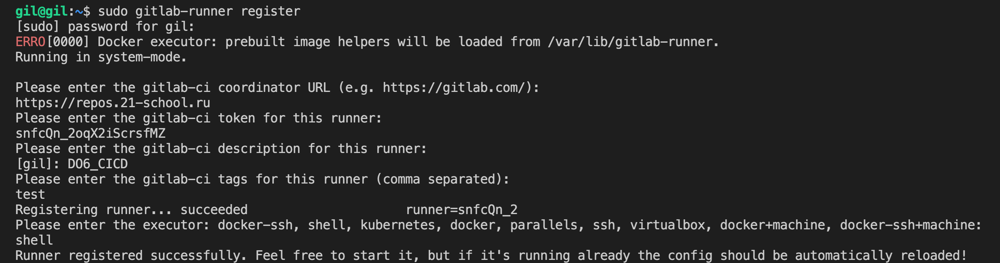

## Part 2. Сборка

**== Задание ==**

#### Написать этап для **CI** по сборке приложений из проекта *C2_SimpleBashUtils*:

##### В файле _gitlab-ci.yml_ добавить этап запуска сборки через мейк файл из проекта _C2_

##### Файлы, полученные после сборки (артефакты), сохранять в произвольную директорию со сроком хранения 30 дней.

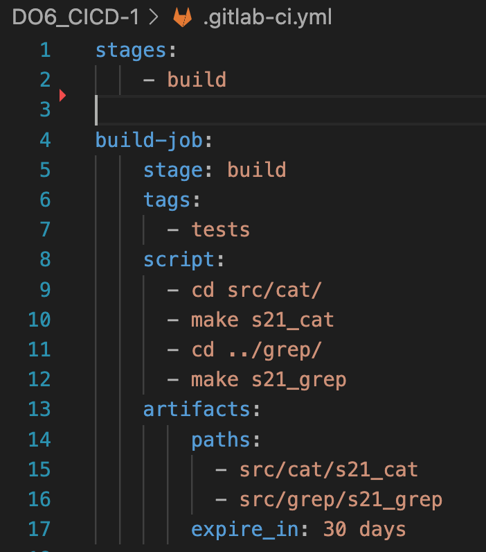

## Part 3. Тест кодстайла

**== Задание ==**

#### Написать этап для **CI**, который запускает скрипт кодстайла (*clang-format*):

##### Если кодстайл не прошел, то "зафейлить" пайплайн

##### В пайплайне отобразить вывод утилиты *clang-format*

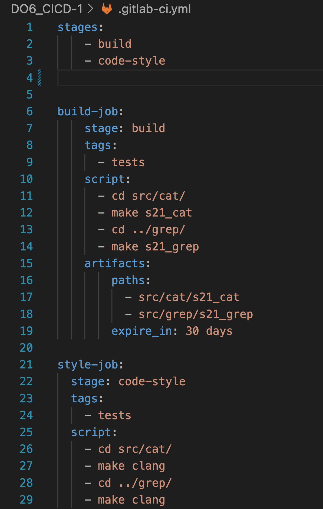

## Part 4. Интеграционные тесты

**== Задание ==**

#### Написать этап для **CI**, который запускает ваши интеграционные тесты из того же проекта:

##### Запускать этот этап автоматически только при условии, если сборка и тест кодстайла прошли успешно

##### Если тесты не прошли, то "зафейлить" пайплайн

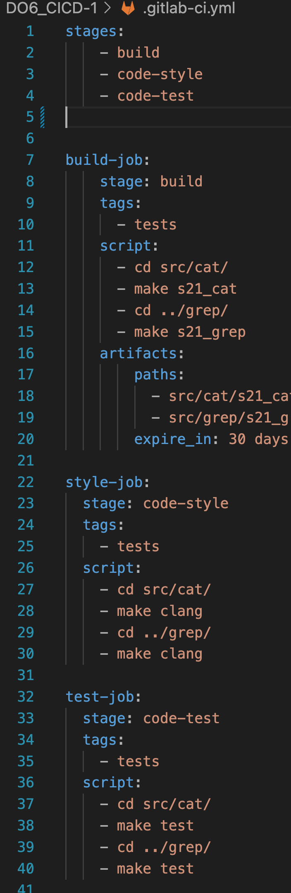

## Part 5. Этап деплоя

**== Задание ==**

##### Поднять вторую виртуальную машину *Ubuntu Server 20.04 LTS*

#### Написать этап для **CD**, который "разворачивает" проект на другой виртуальной машине:

##### Запускать этот этап вручную при условии, что все предыдущие этапы прошли успешно

##### Написать bash-скрипт, который при помощи **ssh** и **scp** копирует файлы, полученные после сборки (артефакты), в директорию */usr/local/bin* второй виртуальной машины

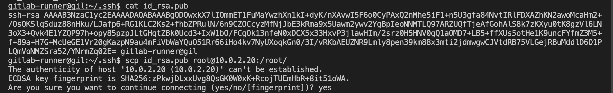

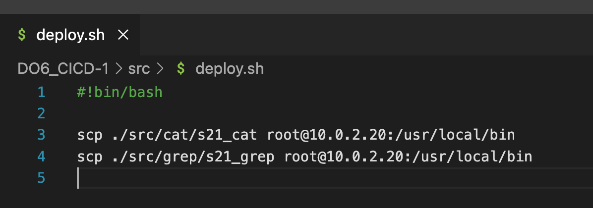

##### В файле _gitlab-ci.yml_ добавить этап запуска написанного скрипта

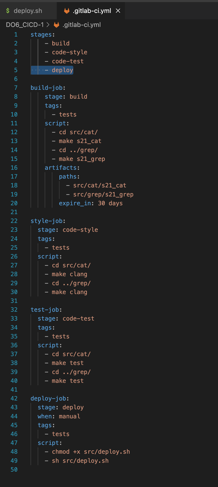

В результате вы должны получить готовые к работе приложения из проекта *C2_SimpleBashUtils* (s21_cat и s21_grep) на второй виртуальной машине.

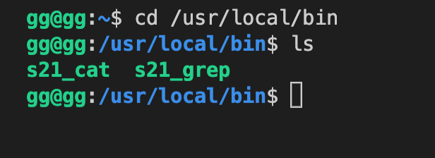

##### Сохранить дампы образов виртуальных машин

## Part 6. Дополнительно. Уведомления

**== Задание ==**

##### Настроить уведомления о успешном/неуспешном выполнении пайплайна через бота с именем "[ваш nickname] DO6 CI/CD" в *Telegram*

- Текст уведомления должен содержать информацию об успешности прохождения как этапа **CI**, так и этапа **CD**.
- В остальном текст уведомления может быть произвольным.

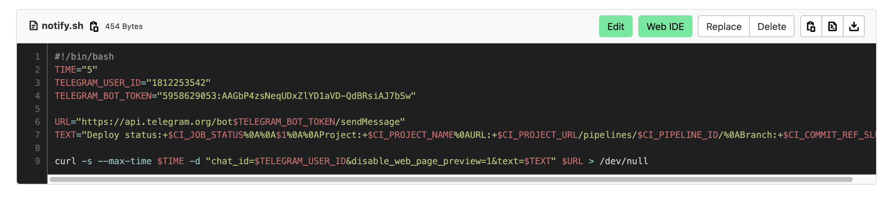

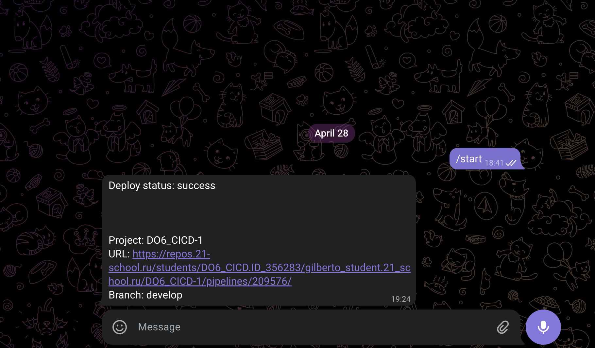

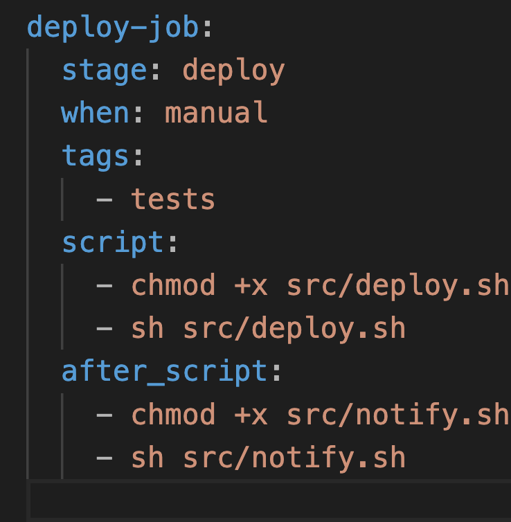

